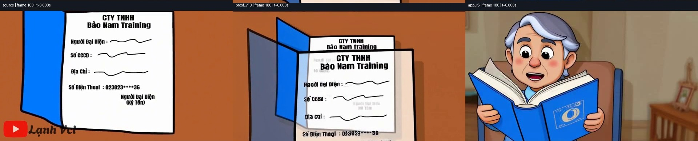

# Bằng chứng review — phân biệt render và sản phẩm được chấp thuận

Đây là mẫu lỗi phục vụ developer review. **QUALITY_ACCEPTED=0**. Hash/size ở [ARTIFACT_INDEX.json](ARTIFACT_INDEX.json).

## Kiểm chứng độc lập, snapshot buổi sáng 29/09

- R4 và R5 publication cùng SHA-256 `075133f3d2d6918d7cff3a036d7234ce64e154b06b09fe8dbc4b1b04ff9fa269`.
- [R5_RENDER_ONLY_NOT_ACCEPTED.mp4](R5_RENDER_ONLY_NOT_ACCEPTED.mp4): 12 giây, 360 frame, 640×360, MPEG4 video-only; render thực nhưng sai nội dung, chưa phải S12 export được chấp thuận.
- [compare_book.jpg](compare_book.jpg): không giữ đúng event mở sách và cast.
- [compare_turn.jpg](compare_turn.jpg): cảnh giấy + zoom biến thành người đọc sách.
- [compare_occ.jpg](compare_occ.jpg): cảnh ký giấy/cut biến thành phụ nữ đọc sách.
- [CUT_AUDIT.json](CUT_AUDIT.json): đo boundary source 121/241/343 so với manifest 120/240. Đường dẫn local trong JSON là provenance máy đo, không phải tài nguyên đã bundled.



Ảnh đối chiếu frame 180 thể hiện source/proof/app trong cùng hàng. Nhãn trên ảnh giữ nguyên từ audit. Proof có audio và một số xử lý cut tốt hơn nhưng vẫn chưa đạt toàn bộ hợp đồng; không dùng proof để chứng nhận app.

## Tiến độ mới hơn: báo cáo Manager lúc 17:10 +07

[MANAGER_MATRIX_1710.md](MANAGER_MATRIX_1710.md) được chụp lại khi bàn giao, chưa phải một lượt tái lập độc lập. Nó báo audio attach completed, một S12 export run thật qua ba chunk rồi thất bại validation `av_policy`. C11 lúc matrix còn pending; đến 17:11 đã có commit `e3b1301`, được giữ trên ref riêng.

Hai snapshot không mâu thuẫn: buổi sáng R5 chưa có export run; buổi chiều đã thử export và gặp blocker mới ở validation. File video failed đính kèm ở đây vẫn là publication ban đầu. Không gọi nó là final MP4 mới sau sửa audio.

## Tái kiểm tra media đã bundled

Từ root repository, với ffprobe/ffmpeg trong PATH:

```powershell
Get-FileHash docs/external-review/evidence/R5_RENDER_ONLY_NOT_ACCEPTED.mp4 -Algorithm SHA256
ffprobe -v error -show_streams -show_format -of json docs/external-review/evidence/R5_RENDER_ONLY_NOT_ACCEPTED.mp4
ffmpeg -v error -i docs/external-review/evidence/R5_RENDER_ONLY_NOT_ACCEPTED.mp4 -f null -
```

Decode thành công chỉ chứng minh file đọc được. Để nghiệm thu reskin phải đối chiếu source/cast/control/time map và các event, contact, occlusion, camera, audio theo hồ sơ BA. Clip nguồn đầy đủ và runtime DB không bundled; tái lập GPU đầy đủ cần bàn giao input hợp lệ cùng model/runtime theo onboarding.
